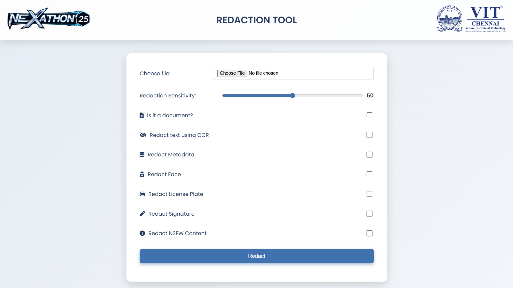
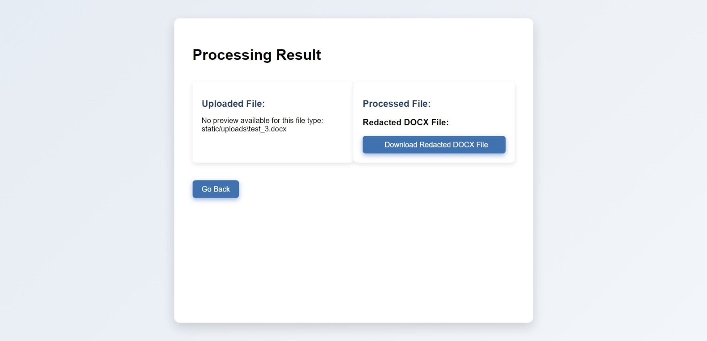

# RE-Dact Tool

<p>
  
  
</p>


### Multi-file Format Automatic Redaction Tool

This is a Flask-based web application designed to automatically detect redact sensitive content from various file formats (.TXT, .JPG, .JPEG, .PNG, .DOCX, .ODT, etc.) without any dependency on external APIs or internet.

### Features

- Detects and blurs faces in images.
- Redacts vehicle license plates.
- Removes metadata from all files.
- Redacts signatures in images and documents.

---

## Example Frontend




## Redaction in Action


Besides this, text contents, image metadata, OCR recognbised text content, nsfw content (build for this one is yet in progress) is also redacted.

---

## Project Directory Structure

bash 
```
re-dact/
├── __pycache__/
├── datasets/
│   └── signature/
│       ├── train/
│       ├── valid/
│       └── signature.yaml
├── services/
│   ├── __pycache__/
│   ├── addons/
│   │   ├── best.pt
│   │   ├── digiSignBlur.py
│   │   ├── digiSignBlur2.py
│   │   ├── direct.py
│   │   ├── faceBlur.py
│   │   ├── numPlateBlur.py
│   │   ├── numPlateDetecModel.pt
│   │   ├── ocrBlur.py
│   │   ├── patterns.py
│   │   ├── removeMetadata.py
│   │   └── placeholder.py
│   │   └── nsfwBlur.py
│   ├── __init__.py
│   ├── docx.py
│   ├── img.py
│   ├── others.py
│   ├── pdf.py
│   └── txt.py
├── static/
│   ├── assets/
│   │   ├── logo (1).png
│   │   ├── logo.png
│   │   ├── pattern.png
│   │   ├── pattern2.png
│   │   ├── vit.png
│   │   └── vit3.png
│   ├── uploads/
│   └── styles.css
├── templates/
├── app.py
├── pandoc-3.3-windows-x86_64.msi
└── tempCodeRunnerFile.py
```


0. digiSignBlur2.py:
This is based on my custom trained model on my self labeled dataset https://github.com/anshikkumartiwari/siginature-detection-blur 

1. digiSignBlur2.py:
Two modules are assigned to handle signatures one of them is sourced from https://github.com/ahmetozlu/signature_extractor with slight modifications.

2. numPlateBlur.py:
This one is sourced from BLANK_ with slight modifications.


---