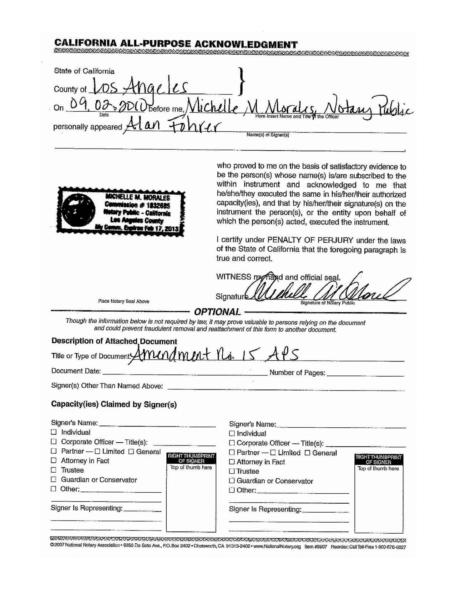

# RE-Dact Tool
### Multi-file Format Automatic Redaction Tool


[](https://travis-ci.org/joemccann/dillinger)

This tool is a Flask-based application designed to automatically redact sensitive content from various file formats. The supported formats include:

- **Text Files (.txt)**
- **Images (.jpg, .png)**
- **Documents (.docx)**
- **PDFs (.pdf)**

### Features

- Detects and blurs faces in images.
- Redacts vehicle license plates.
- Removes metadata from all files.
- Redacts signatures in images and documents.

---

## Example Frontend


## Redaction in Action

**Before Redaction:**


**After Redaction:**


---

## Project Directory Structure

```bash
re-dact/
├── __pycache__/
├── datasets/
│   └── signature/
│       ├── train/
│       ├── valid/
│       └── signature.yaml
├── services/
│   ├── __pycache__/
│   ├── addons/
│   │   ├── best.pt
│   │   ├── digiSignBlur.py
│   │   ├── digiSignBlur2.py
│   │   ├── direct.py
│   │   ├── faceBlur.py
│   │   ├── numPlateBlur.py
│   │   ├── numPlateDetecModel.pt
│   │   ├── ocrBlur.py
│   │   ├── patterns.py
│   │   ├── removeMetadata.py
│   │   └── placeholder.py
│   │   └── nsfwBlur.py
│   ├── __init__.py
│   ├── docx.py
│   ├── img.py
│   ├── others.py
│   ├── pdf.py
│   └── txt.py
├── static/
│   ├── assets/
│   │   ├── logo (1).png
│   │   ├── logo.png
│   │   ├── pattern.png
│   │   ├── pattern2.png
│   │   ├── vit.png
│   │   └── vit3.png
│   ├── uploads/
│   └── styles.css
├── templates/
├── app.py
├── pandoc-3.3-windows-x86_64.msi
└── tempCodeRunnerFile.py
```

## Installation

Make sure you have [Python 3.8+](https://www.python.org/) installed.

1. Clone the repository:

```bash
git clone https://github.com/your-username/re-dact-tool.git
cd re-dact-tool
```

2. Install dependencies:

```bash
pip install -r requirements.txt (will be available soon)
```

3. Run the application:

```bash
python app.py
```

The app will be available at `http://127.0.0.1:5000` in your browser.

---

## Resources and References

Make sure you have [Python 3.8+](https://www.python.org/) installed.


0. digiSignBlur2.py:
This is based on my custom trained model on my self labeled dataset `https://github.com/anshikkumartiwari/siginature-detection-blur` 

1. digiSignBlur2.py:
Two modules are assigned to handle signatures one of them is sourced from `https://github.com/ahmetozlu/signature_extractor` with slight modifications.

2. numPlateBlur.py:
This one is sourced from `BLANK_` with slight modifications.


---
